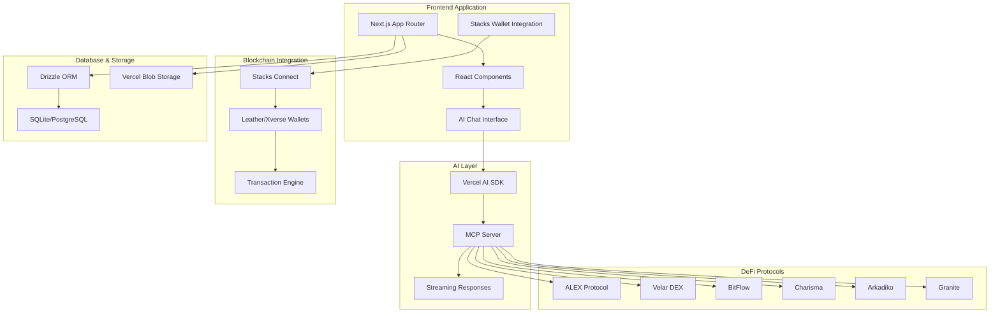

# Stacks Bitcoin DeFi Terminal ~ Frontend

**Stop visiting websites. Start talking to Bitcoin DeFi.**

The Stacks ecosystem offers the most comprehensive Bitcoin DeFi infrastructure - but users are drowning in interfaces. We solved it by making Bitcoin DeFi operations as simple as sending a text message.

#### THIS IS THE INTERFACE FOR BITCOIN DEFI.

## Overview

**232+ operations. 8+ protocols. 1 conversation.**

Stacks' Bitcoin DeFi ecosystem is exploding with innovation - DEXes, lending protocols, stacking, NFTs, and more. We've built the first comprehensive chat interface that makes all of it accessible through natural language.

**We've built what everyone else is promising:**
- 232+ live Bitcoin DeFi operations (not promises)
- Natural language access to ALEX, Velar, BitFlow, Charisma, Arkadiko, Granite, and more
- Real-time AI streaming with live blockchain data
- Native Bitcoin security with Stacks Proof of Transfer

## Architecture Frontend



## System Components

### Frontend Framework
- **Next.js 15**: React framework with App Router for modern web development
- **TypeScript**: Type-safe development with comprehensive type definitions
- **Tailwind CSS**: Utility-first styling with responsive design patterns
- **Framer Motion**: Advanced animations and interactive transitions

### AI Integration
- **Vercel AI SDK**: Streaming AI responses with tool calling capabilities
- **MCP Server**: Model Context Protocol server exposing 232+ Stacks operations
- **OpenAI Integration**: GPT models fine-tuned for Bitcoin DeFi and Stacks context
- **Real-time Streaming**: Live AI responses with progressive data loading

### Blockchain Connectivity
- **Stacks Connect**: Official Stacks wallet integration via @stacks/connect
- **Leather & Xverse**: Primary wallet support for transaction signing
- **Transaction Engine**: Automated transaction building and broadcasting
- **Multi-Network Support**: Testnet and Mainnet compatibility

## Features

### AI-Powered Bitcoin DeFi
- **Natural Language Processing**: Convert conversational commands to DeFi operations
- **Context-Aware Responses**: AI understands Stacks and Bitcoin DeFi terminology
- **Tool Execution**: Automated execution of DeFi operations through 232+ MCP tools
- **Progressive Loading**: Real-time streaming of AI responses and blockchain data

### DeFi Protocol Operations

#### DEX Trading (ALEX, Velar, BitFlow, Charisma)
- Multi-hop swaps with optimal routing (up to 4 hops on ALEX)
- Liquidity pool analytics with TVL, volume, and APY
- Real-time token prices and 24h changes
- Slippage protection and MEV resistance

#### Lending Protocols (Arkadiko, Granite)
- Collateralized borrowing with health factor monitoring
- Yield-bearing deposits with real-time APY
- Vault management with liquidation warnings
- Multi-collateral support

#### Stacking (Proof of Transfer)
- Stack STX to earn Bitcoin yields
- Delegation to stacking pools
- PoX cycle tracking and reward estimation
- Unlock height monitoring

#### Token & NFT Management
- STX balance tracking with locked amounts
- SIP-010 fungible token balances
- SIP-009 NFT collections
- Token metadata and contract information

#### Blockchain Data
- Block information and transaction details
- Network statistics and consensus data
- Contract interaction and event tracking
- Address balance history

## Protocol Integrations

### **ALEX Protocol**
Comprehensive AMM and orderbook DEX with launchpad features. Supports 1-4 hop multi-path swaps for optimal pricing across the liquidity network.

### **Velar DEX**
Multi-chain DEX with advanced liquidity pools. Provides real-time price feeds and cross-chain swap capabilities.

### **BitFlow**
Stable-focused DEX with concentrated liquidity. Optimized for stablecoin swaps and low slippage trading.

### **Charisma**
Composable DeFi protocol with customizable vaults. Includes the Blaze intent protocol for advanced trading strategies.

### **Arkadiko Protocol**
Decentralized stablecoin protocol issuing USDA. Enables collateralized borrowing and yield farming with STX.

### **Granite Finance**
Multi-collateral lending market with isolated risk pools. Supports various Stacks tokens as collateral.

### **Bitcoin Name Service (BNS)**
Decentralized naming system for Stacks addresses using .btc domains. Fully integrated for human-readable addresses.

## Technology Stack

### Core Framework
- **Next.js 15**: Modern React framework with App Router architecture
- **React 19 RC**: Latest React features with concurrent rendering
- **TypeScript 5.6**: Enhanced type safety and developer experience
- **Tailwind CSS 3.4**: Responsive utility-first styling system

### AI & Data Processing
- **Vercel AI SDK 5.0**: Advanced AI integration with streaming capabilities
- **OpenAI GPT**: Fine-tuned models for Bitcoin DeFi domain expertise
- **MCP Server**: Model Context Protocol for blockchain operations
- **Streaming APIs**: Real-time data processing and response generation

### Blockchain Integration
- **@stacks/connect**: Official Stacks wallet connection library
- **Leather Wallet**: Primary wallet for Stacks ecosystem
- **Xverse Wallet**: Alternative wallet with Bitcoin and Stacks support
- **Clarity SDK**: Smart contract interaction with Clarity language

### Database & Storage
- **Drizzle ORM 0.34**: Type-safe database operations
- **Better SQLite3**: High-performance local database
- **Vercel Postgres**: Scalable cloud database option
- **Vercel Blob Storage**: File and asset management

### Development Tools
- **Biome**: Fast code formatting and linting
- **Playwright**: End-to-end testing framework
- **ESLint**: Code quality and consistency
- **Vercel Analytics**: Performance monitoring and insights

## Quick Start

### Prerequisites
- Node.js 18 or higher
- pnpm package manager
- Stacks wallet (Leather or Xverse)
- Running MCP server instance
- Environment variables configured

### Installation

1. **Clone and install dependencies**
   ```bash
   git clone <repository-url>
   cd vechain-terminal-frontend
   pnpm install
   ```

2. **Configure environment variables**
   ```bash
   cp .env.example .env.local
   ```
   Edit `.env.local` with your API keys and configuration:
   ```env
   OPENAI_API_KEY=your_openai_api_key
   STACKS_NETWORK=testnet
   MCP_SERVER_URL=http://localhost:3000
   DATABASE_URL=your_database_url
   ```

3. **Initialize database**
   ```bash
   pnpm db:generate
   pnpm db:migrate
   ```

4. **Start development server**
   ```bash
   pnpm dev
   ```

   The application will be available at `http://localhost:3000`

### Database Management

```bash
# Generate database migrations
pnpm db:generate

# Run migrations
pnpm db:migrate

# Open database studio
pnpm db:studio

# Push schema changes
pnpm db:push
```

## Usage Examples

### DEX Trading
```
"Swap 100 STX for ALEX on ALEX Protocol"
"Show me all liquidity pools on Velar"
"What's the current price of sBTC?"
"Find the best route to swap USDA for ALEX with minimal slippage"
```

### Lending Operations
```
"Borrow 1000 USDA from Arkadiko using STX as collateral"
"Check my health factor on Granite"
"Deposit 500 STX into Arkadiko vault"
"What's the current APY for lending sBTC on Granite?"
```

### Stacking (PoX)
```
"Stack 10,000 STX for Bitcoin rewards"
"How much Bitcoin can I earn by stacking?"
"Check my current stacking status"
"Delegate my STX to a stacking pool"
```

### Token & NFT Operations
```
"Show me my STX balance and all tokens"
"Check my NFT collections"
"Transfer 50 ALEX tokens to SP2..."
"What SIP-010 tokens do I hold?"
```

### Blockchain Data
```
"Get information about block 150000"
"Show me transaction details for 0x1234..."
"What's the current network status?"
"Check the latest PoX cycle information"
```

## Development

### Project Structure

```
src/
├── app/                          # Next.js App Router pages
├── components/
│   ├── stacks-dex/              # DEX components (swaps, pools, prices)
│   ├── stacks-lending/          # Lending protocol components
│   ├── stacks-stacking/         # PoX stacking components
│   ├── stacks-tokens/           # Token and NFT displays
│   ├── stacks-core/             # Blockchain info components
│   ├── stacks-transactions/     # Transaction execution
│   └── message.tsx              # Message router
├── hooks/
│   ├── useHandleTransaction.ts  # Transaction signing hook
│   └── use-wallet-auth.ts       # Wallet authentication
├── lib/
│   ├── ai/                      # AI integration
│   │   └── prompts.ts           # Stacks-specific prompts
│   ├── db/                      # Database configuration
│   └── utils/                   # Utility functions
└── types/                       # TypeScript type definitions
```

### Component Architecture

All components follow a consistent three-state pattern:

1. **Loading State**: Skeleton loaders with pulsing animation
2. **Error State**: Descriptive error messages in red cards
3. **Success State**: Clean, organized data display

Example component structure:
```typescript
export default function ComponentName({ data, isLoading }: Props) {
  if (isLoading) {
    return <LoadingSkeleton />;
  }

  if (!data.success || !data.data) {
    return <ErrorCard error={data.error} />;
  }

  return <SuccessDisplay data={data.data} />;
}
```

### Adding New Components

1. **Create component in appropriate directory**
   ```typescript
   // components/stacks-dex/NewComponent.tsx
   export default function NewComponent({ data, isLoading }: Props) {
     // Implementation
   }
   ```

2. **Add routing in `components/message.tsx`**
   ```typescript
   if (type === "tool-new_operation") {
     if ("toolCallId" in part && "state" in part) {
       const { toolCallId, state } = part;
       if (state === "output-available" && "output" in part) {
         return <NewComponent data={output} isLoading={false} />;
       }
     }
   }
   ```

3. **Update MCP server to expose new tool**

### Testing

```bash
# Run development server
pnpm dev

# Type checking
pnpm typecheck

# Linting and formatting
pnpm lint
pnpm format

# End-to-end testing
pnpm test
```

## Security Considerations

### Wallet Security
- Client-side wallet integration with @stacks/connect
- No private key storage on servers
- Secure transaction signing through Leather/Xverse wallets
- Network isolation between testnet and mainnet

### Transaction Security
- User confirmation required for all write operations
- Clear transaction details displayed before signing
- Gas estimation and fee calculation
- Transaction status tracking and confirmation

### API Security
- Environment variable protection for API keys
- Rate limiting on external API calls
- Input validation and sanitization
- HTTPS-only communication

### Application Security
- Content Security Policy implementation
- XSS protection through React's built-in safeguards
- SQL injection prevention with Drizzle ORM
- Secure session management

## Contributing

This project welcomes contributions for improving Bitcoin DeFi accessibility:

1. Fork the repository and create feature branches
2. Follow TypeScript and React best practices
3. Add comprehensive tests for new functionality
4. Update documentation for UI/UX changes
5. Submit pull requests with detailed descriptions

## License

MIT License - see LICENSE file for complete terms and conditions.

---

**Stacks Bitcoin DeFi Terminal** - Making Bitcoin DeFi as simple as conversation. Built for the Stacks Vibe Coding Hackathon.
