# Stacks AI ~ Frontend


## Roadmap


**Talk to Bitcoin. Trade, lend, stack - through conversation.**

Stacks AI makes the entire Bitcoin DeFi ecosystem accessible through natural language. Access ALEX, Velar, BitFlow, Arkadiko, Granite, and more - just by talking.

Part of the **Stacks AI** project - a comprehensive AI-powered interface for Bitcoin DeFi built on Stacks.

[](https://nextjs.org/)
[](https://react.dev/)
[](https://www.typescriptlang.org/)
[](https://www.stacks.co/)
[](#protocol-integrations)

---

## Table of Contents

- [Overview](#overview)
- [Features](#features)
  - [AI-Powered Bitcoin DeFi](#ai-powered-bitcoin-defi)
  - [DeFi Protocol Operations](#defi-protocol-operations)
- [Architecture](#architecture)
  - [System Overview](#system-overview)
  - [MCP Plugin Architecture](#mcp-plugin-architecture)
  - [Data Flow](#data-flow)
- [Protocol Integrations](#protocol-integrations)
- [Technology Stack](#technology-stack)
- [Quick Start](#quick-start)
- [Usage Examples](#usage-examples)
- [Component Architecture](#component-architecture)
- [Security Considerations](#security-considerations)
- [Contributing](#contributing)

---

## Overview

**100+ operations. 8+ protocols. 1 conversation.**

```mermaid
graph LR
    User[👤 You] -->|"swap 100 STX for sBTC"| AI[🤖 StacksAI]
    AI -->|Executes| DEX[ALEX/Velar/BitFlow]
    AI -->|Executes| Lending[Arkadiko/Granite]
    AI -->|Executes| Stacking[PoX Cycles]
    AI -->|Executes| NFTs[SIP-009 NFTs]

    style AI fill:#fc8d36
    style User fill:#5546ff
```



**We've built what everyone else is promising:**
- 100+ live Bitcoin DeFi operations (not promises)
- Natural language access to ALEX, Velar, BitFlow, Charisma, Arkadiko, Granite
- Real-time AI streaming with live blockchain data
- Native Bitcoin security with Stacks Proof of Transfer

## Architecture

### System Overview


### MCP Plugin Architecture


### Data Flow

```mermaid
sequenceDiagram
    participant User
    participant Frontend
    participant AI
    participant MCP
    participant Wallet
    participant Stacks

    User->>Frontend: "swap 100 STX for ALEX"
    Frontend->>AI: Process natural language
    AI->>MCP: Call alexSwapTokens tool
    MCP->>MCP: Build transaction
    MCP->>Frontend: Return unsigned tx
    Frontend->>Wallet: Request signature
    Wallet->>User: Confirm transaction?
    User->>Wallet: Approve
    Wallet->>Stacks: Broadcast signed tx
    Stacks->>Frontend: Transaction hash
    Frontend->>User: "✅ Swap executed"
```



## Features

### AI-Powered Bitcoin DeFi
- **Natural Language Processing**: Convert conversational commands to DeFi operations
- **Context-Aware Responses**: AI understands Stacks and Bitcoin DeFi terminology
- **Tool Execution**: Automated execution of DeFi operations through 100+ MCP tools
- **Progressive Loading**: Real-time streaming of AI responses and blockchain data

### DeFi Protocol Operations

#### DEX Trading (ALEX, Velar, BitFlow, Charisma)
- Multi-hop swaps with optimal routing (up to 4 hops on ALEX)
- Liquidity pool analytics with TVL, volume, and APY
- Real-time token prices and 24h changes
- Slippage protection and MEV resistance

#### Lending Protocols (Arkadiko, Granite)
- Collateralized borrowing with health factor monitoring
- Yield-bearing deposits with real-time APY
- Vault management with liquidation warnings
- Multi-collateral support

#### Stacking (Proof of Transfer)
- Stack STX to earn Bitcoin yields
- Delegation to stacking pools
- PoX cycle tracking and reward estimation
- Unlock height monitoring

#### Token & NFT Management
- STX balance tracking with locked amounts
- SIP-010 fungible token balances
- SIP-009 NFT collections
- Token metadata and contract information

#### Blockchain Data
- Block information and transaction details
- Network statistics and consensus data
- Contract interaction and event tracking
- Address balance history

#### Clarity Smart Contract Development
- Generate complete Clarinet project setups with templates
- Create SIP-009 NFT and SIP-010 FT contracts
- Generate comprehensive test suites (unit, integration, security)
- Configure projects for different networks (mainnet, testnet, devnet)

## Protocol Integrations

### **ALEX Protocol** (11 tools)
Comprehensive AMM and orderbook DEX with launchpad features. Supports 1-4 hop multi-path swaps for optimal pricing across the liquidity network.

### **Velar DEX** (9 tools)
Multi-chain DEX with advanced liquidity pools. Provides real-time price feeds and cross-chain swap capabilities.

### **BitFlow** (5 tools)
Stable-focused DEX with concentrated liquidity. Optimized for stablecoin swaps and low slippage trading.

### **Charisma** (5 tools)
Composable DeFi protocol with customizable vaults. Includes the Blaze intent protocol for advanced trading strategies.

### **Arkadiko Protocol** (7 tools)
Decentralized stablecoin protocol issuing USDA. Enables collateralized borrowing and yield farming with STX.

### **Granite Finance** (6 tools)
Multi-collateral lending market with isolated risk pools. Supports various Stacks tokens as collateral.

### **Bitcoin Name Service** (BNS)
Decentralized naming system for Stacks addresses using .btc domains. Fully integrated for human-readable addresses.

### **Clarinet Development Tools** (4 tools)
Smart contract development toolkit for Clarity developers. Generate projects, contracts, tests, and network configurations for Stacks blockchain development.

## Technology Stack

### Core Framework
- **Next.js 15**: Modern React framework with App Router architecture
- **React 19 RC**: Latest React features with concurrent rendering
- **TypeScript 5.6**: Enhanced type safety and developer experience
- **Tailwind CSS 3.4**: Responsive utility-first styling system

### AI & Data Processing
- **Vercel AI SDK 5.0**: Advanced AI integration with streaming capabilities
- **OpenAI GPT**: Fine-tuned models for Bitcoin DeFi domain expertise
- **MCP Server**: Model Context Protocol for blockchain operations
- **Streaming APIs**: Real-time data processing and response generation

### Blockchain Integration
- **@stacks/connect**: Official Stacks wallet connection library
- **Leather Wallet**: Primary wallet for Stacks ecosystem
- **Xverse Wallet**: Alternative wallet with Bitcoin and Stacks support
- **Clarity SDK**: Smart contract interaction with Clarity language

### Database & Storage
- **Drizzle ORM 0.34**: Type-safe database operations
- **Better SQLite3**: High-performance local database
- **Vercel Postgres**: Scalable cloud database option
- **Vercel Blob Storage**: File and asset management

## Quick Start

### Prerequisites
- Node.js 18 or higher
- pnpm package manager
- Stacks wallet (Leather or Xverse)
- Running MCP server instance
- Environment variables configured

### Installation

1. **Clone and install dependencies**
   ```bash
   git clone <repository-url>
   cd vechain-terminal-frontend
   pnpm install
   ```

2. **Configure environment variables**
   ```bash
   cp .env.example .env.local
   ```
   Edit `.env.local` with your API keys and configuration:
   ```env
   OPENAI_API_KEY=your_openai_api_key
   STACKS_NETWORK=testnet
   MCP_SERVER_URL=http://localhost:3000
   DATABASE_URL=your_database_url
   ```

3. **Initialize database**
   ```bash
   pnpm db:generate
   pnpm db:migrate
   ```

4. **Start development server**
   ```bash
   pnpm dev
   ```

   The application will be available at `http://localhost:3000`

## Usage Examples

### DEX Trading
```
"Swap 100 STX for ALEX on ALEX Protocol"
"Show me all liquidity pools on Velar"
"What's the current price of sBTC?"
"Find the best route to swap USDA for ALEX with minimal slippage"
```

### Lending Operations
```
"Borrow 1000 USDA from Arkadiko using STX as collateral"
"Check my health factor on Granite"
"Deposit 500 STX into Arkadiko vault"
"What's the current APY for lending sBTC on Granite?"
```

### Stacking (PoX)
```
"Stack 10,000 STX for Bitcoin rewards"
"How much Bitcoin can I earn by stacking?"
"Check my current stacking status"
"Delegate my STX to a stacking pool"
```

### Token & NFT Operations
```
"Show me my STX balance and all tokens"
"Check my NFT collections"
"Transfer 50 ALEX tokens to SP2..."
"What SIP-010 tokens do I hold?"
```

### Smart Contract Development
```
"Create a new Clarinet project for an NFT marketplace"
"Generate a SIP-010 fungible token contract called MyToken"
"Generate unit tests for my counter contract"
"Show me how to configure for testnet deployment"
```

## Component Architecture

### UI Component Structure

```mermaid
graph TB
    subgraph "Message Router"
        M[message.tsx<br/>Tool Routing Hub]
    end

    subgraph "Display Components"
        D1[🔄 DEX Components<br/>SwapInfo, PoolList, TokenPrices, PoolStats]
        D2[💰 Lending Components<br/>LendingInfo]
        D3[📊 Account Components<br/>AccountInfo, TransactionHistory]
        D4[🖼️ NFT Components<br/>NFTGallery]
        D5[📜 Contract Components<br/>ContractInfo, EventList]
        D6[🏦 Stacking Components<br/>StackingInfo, CycleInfo]
        D7[⛓️ Core Components<br/>BlockchainInfo, FeeEstimate]
        D8[🛠️ Development Components<br/>ClarinetsGuide, ClarityContract, ContractTests]
    end

    M --> D1 & D2 & D3 & D4 & D5 & D6 & D7 & D8

    style M fill:#fc8d36
```



All components follow a consistent three-state pattern:

1. **Loading State**: Skeleton loaders with pulsing animation
2. **Error State**: Descriptive error messages in red cards
3. **Success State**: Clean, organized data display

## Security Considerations

### Wallet Security
- Client-side wallet integration with @stacks/connect
- No private key storage on servers
- Secure transaction signing through Leather/Xverse wallets
- Network isolation between testnet and mainnet

### Transaction Security
- User confirmation required for all write operations
- Clear transaction details displayed before signing
- Gas estimation and fee calculation
- Transaction status tracking and confirmation

### API Security
- Environment variable protection for API keys
- Rate limiting on external API calls
- Input validation and sanitization
- HTTPS-only communication

## Contributing

This project welcomes contributions for improving Bitcoin DeFi accessibility:

1. Fork the repository and create feature branches
2. Follow TypeScript and React best practices
3. Add comprehensive tests for new functionality
4. Update documentation for UI/UX changes
5. Submit pull requests with detailed descriptions

## License

MIT License - see LICENSE file for complete terms and conditions.

---

## Summary

**Stacks AI Frontend** is the user-facing component of the Stacks AI project, providing a natural language chat interface to interact with Bitcoin DeFi on Stacks Layer 2. Built with Next.js 15, React 19, and the Vercel AI SDK, it integrates with the Stacks AI MCP Server to expose 148+ DeFi operations through conversational AI.

The frontend implements real-time AI streaming, Stacks wallet integration (Leather/Xverse), and a comprehensive component library for displaying DeFi data. It follows modern React patterns with TypeScript type safety and responsive design.

---

**Stacks AI - Talk to Bitcoin**

Making Bitcoin DeFi as simple as conversation.
